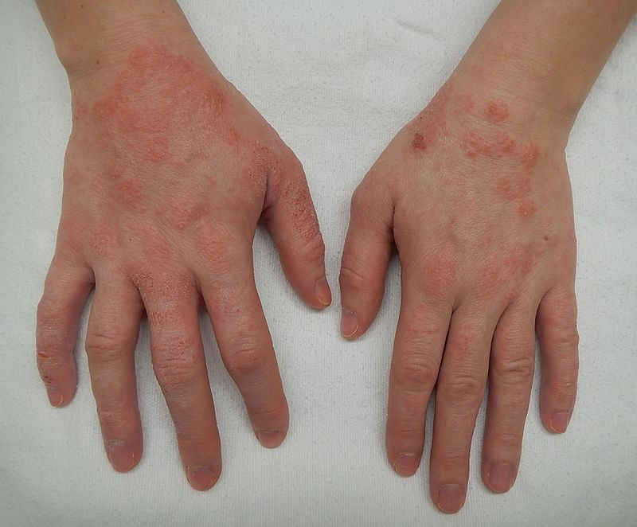
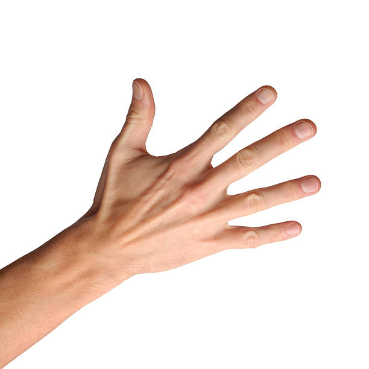
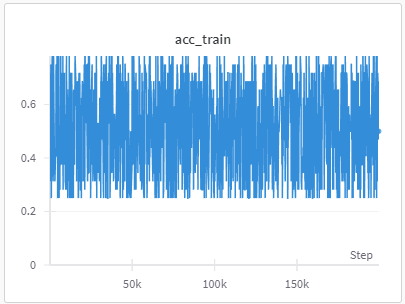

# **DermDetect**

  
  
  *Unleashing the Power of AI to Transform Skin Health – Your Smart Solution for Eczema Detection!*

## **How we use AI**
Our approach involves testing the program on a dataset with 25 images of clear skin, and 25 images of skin afflicted with Dermatitis. In order to enhance image differentiation, we employ AlexNet, a deep convolutional neural network. In order to run this Machine Learning Model, we use Google Colab which uses Python programming. Using the dataset to train the model enables AlexNet to accurately distinguish between the two scenarios, aligning with our goal of effective image differentiation.

## **The Mission**
Dermatitis is a general term that is described as inflammation of the skin. With there being many types of Dermatitis, DermDetect seeks to utilize AI in order to identify and offer solutions that cater to the individual.

Many times when seeking professional help, we are often put on steroidal creams that only work for an unspecified amount of time until the body adapts. Once the body adapts it isn't uncommon to be put on steroidal creams that are stronger, until the point that the skin become dependent on this drug. The aim of DermDetect is to offer a more holistic solution based on the data we collect.

## **How it Functions**
+ Take a Picture of the affected area
+ Our program will cross-reference the image with our database to identify the most liekly type of dermatitis
+ Based on the result, we'll offer steps you can take to treat your dermatitis

## **[DataSet](https://docs.google.com/presentation/d/1de_ewFR2glJJFp4gsO9khWyvU8vNgPfl83DX63S9vN8/edit#slide=id.p)**
Example

    -vs-   

## **Our AlexNet Model**
[Wanb (Weights & Biases)](https://wandb.ai/site) helps AI developers build better models. Quickly track experiments, version and iterate on datasets, evaluate model performance, reproduce models, and manage ML workflows end-to-end. Researchers and data scientists use Wanb to track and compare model performance metrics, hyperparameters, and other experiment details in a collaborative and organized manner. We leveraged this platform to log and visualize our machine learning experiments. 

